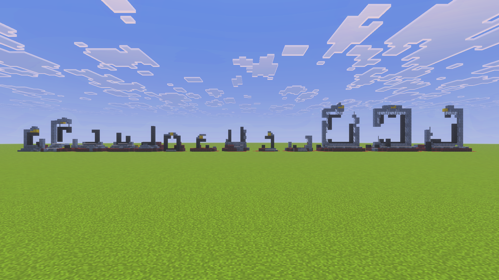

# Nether Generator

> Created by [Th3Emilis](https://github.com/th3emilis)

  

Build Nether structures anywhere in your world in the blink of an eye. Nether Generator comes with all the functions you need to instantly place bastion remnants, ruined portals, and more. Now go bring your superflat worlds to life!

## Features

### Bastion remnants
Generate all bastion variants: bridge, hoglin stables, treasure, and housing units.

### Nether fossils
Generate all 14 types of fossils.

### Ruined portals
Generate all 13 types of ruined Nether portals.

### Compatible with other generators
Seamlessly pair this add-on with other generators, like [Village Generator](https://github.com/th3emilis/village-generator/releases/latest).

## Usage

In the chat screen, type `/function ng/help` to get a list of all the available functions in the main directory. Every subdirectory includes a similar function, such as `/function ng/ruined_portal/help`.

Once you have found the structure you want to generate, make sure you are standing where you want it to be placed. When selecting a location, keep in mind that structures generate diagonally to the right, in the cardinal direction your character is facing. For example, if you are facing east, the structure will generate toward positive `X` and `Y` coordinate values.

Here are a few functions to get you started:
- `/function ng/bastion/bridge`: *Generate a Bridge Bastion Remnant*
- `/function ng/bastion/hoglin_stable`: *Generate a Hoglin Stables Bastion Remnant*
- `/function ng/bastion/treasure`: *Generate a Treasure Bastion Remnant*
- `/function ng/bastion/units`: *Generate a Housing Units Bastion Remnant*
- `/function ng/nether_fossils/fossil_14`: *Generate a Nether Fossil*
- `/function ng/ruined_portal/portal_1`: *Generate a Ruined Portal*

### Recommended settings
In order for bastions to generate correctly, **it is recommended that you set your world’s simulation distance to at least 6 chunks**. Bastions are large structures and attempting to generate them in unloaded chunks may cause unexpected behavior.

### Using on mobile
Most functions follow the same structure naming scheme used internally by Minecraft. However, having to type complex function commands repeatedly on a mobile device becomes tedious very quickly. For a better experience, you can pair the add-on with [Advanchat](https://github.com/th3emilis/advanchat/releases/latest) to start autofilling and accessing previous functions effortlessly.

## License

To learn what you are permitted and not permitted to do with the add-on, see [Nether Generator License](LICENSE.md).

## Feedback

For any suggestions, bugs or help, feel free to [join the Discord community](https://discord.gg/skqthyTkBQ).
